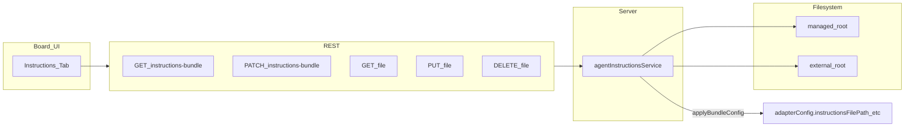

# Paperclip Agent Instructions 实现计划

## 现状与差距

- **参考项目**已实现：[`server/src/services/agent-instructions.ts`](/media/ctyun/datadisk1/exp-projects/paperclip/server/src/services/agent-instructions.ts)（Bundle 扫描/读写/迁移/导出）、[`server/src/routes/agents.ts`](/media/ctyun/datadisk1/exp-projects/paperclip/server/src/routes/agents.ts) 中 5 个路由、`syncInstructionsBundleConfigFromFilePath` 与 `preserveInstructionsBundleConfig`、新建 Agent 后 `materializeDefaultInstructionsBundleForNewAgent`、[`ui/src/pages/AgentDetail.tsx`](/media/ctyun/datadisk1/exp-projects/paperclip/ui/src/pages/AgentDetail.tsx) 的 `PromptsTab`、[`ui/src/components/PackageFileTree.tsx`](/media/ctyun/datadisk1/exp-projects/paperclip/ui/src/components/PackageFileTree.tsx)、[`packages/shared`](/media/ctyun/datadisk1/exp-projects/paperclip/packages/shared) 中的类型与 Zod。
- **当前仓库**已有 [`server/src/home-paths.ts`](/media/ctyun/datadisk1/projects/paperclip/server/src/home-paths.ts)（`resolvePaperclipInstanceRoot` / `resolveHomeAwarePath`），与参考版托管路径一致：`~/.paperclip/instances/{instanceId}/companies/{companyId}/agents/{agentId}/instructions/`。
- **当前仓库缺失**：上述服务/UI/类型；[`server/src/routes/agents.ts`](/media/ctyun/datadisk1/projects/paperclip/server/src/routes/agents.ts) 中 `DEFAULT_INSTRUCTIONS_PATH_KEYS` **未包含 `pi_local`**（与 `pi_local` 适配器及文档不一致，应一并补上）。

## 1. Shared 契约

- 在 [`packages/shared/src/validators/agent.ts`](/media/ctyun/datadisk1/projects/paperclip/packages/shared/src/validators/agent.ts) 增加：`agentInstructionsBundleModeSchema`、`updateAgentInstructionsBundleSchema`、`upsertAgentInstructionsFileSchema`（与参考及你文档中的字段一致）。
- 在 [`packages/shared/src/types/agent.ts`](/media/ctyun/datadisk1/projects/paperclip/packages/shared/src/types/agent.ts) 增加：`AgentInstructionsBundleMode`、`AgentInstructionsFileSummary`、`AgentInstructionsFileDetail`、`AgentInstructionsBundle`。
- 在 [`packages/shared/src/validators/index.ts`](/media/ctyun/datadisk1/projects/paperclip/packages/shared/src/validators/index.ts)、[`packages/shared/src/types/index.ts`](/media/ctyun/datadisk1/projects/paperclip/packages/shared/src/types/index.ts)、[`packages/shared/src/index.ts`](/media/ctyun/datadisk1/projects/paperclip/packages/shared/src/index.ts) 导出新增符号。

## 2. 后端服务

- **新增** [`server/src/services/agent-instructions.ts`](/media/ctyun/datadisk1/projects/paperclip/server/src/services/agent-instructions.ts)：以参考实现为主干移植（路径安全、`listFilesRecursive` 忽略目录、legacy `promptTemplate` / `bootstrapPromptTemplate` 虚拟文件、`applyBundleConfig` 写入 `instructionsBundleMode` / `instructionsRootPath` / `instructionsEntryFile` 并设置 **`instructionsFilePath = join(root, entryFile)`** 以兼容现有各 `*-local` 的 [`execute.ts`](packages/adapters/claude-local/src/server/execute.ts) 读文件逻辑）。
- 导出 **`agentInstructionsService()`** 与 **`syncInstructionsBundleConfigFromFilePath(agent, adapterConfig)`**（参考 [`exp` 中实现](/media/ctyun/datadisk1/exp-projects/paperclip/server/src/services/agent-instructions.ts)）。
- 在 [`server/src/services/index.ts`](/media/ctyun/datadisk1/projects/paperclip/server/src/services/index.ts) 中 re-export。

## 3. 路由与 adapterConfig 一致性

在 [`server/src/routes/agents.ts`](/media/ctyun/datadisk1/projects/paperclip/server/src/routes/agents.ts)：

- 实例化 `const instructions = agentInstructionsService()`。
- 定义 **`KNOWN_INSTRUCTIONS_BUNDLE_KEYS`**（`instructionsBundleMode`、`instructionsRootPath`、`instructionsEntryFile`、以及已有的 path 类 key），在 **`PATCH /agents/:id`** 中若 patch 的 `adapterConfig` 包含任一 bundle 相关 key，则 **`assertCanManageInstructionsPath`**（与改 `instructionsFilePath` 同级权限）。
- **`PATCH /agents/:id/instructions-path`**：在写入 `instructionsFilePath` 后调用 **`syncInstructionsBundleConfigFromFilePath`** 再 `normalizeAdapterConfigForPersistence`（对齐 [参考 1612 行附近](/media/ctyun/datadisk1/exp-projects/paperclip/server/src/routes/agents.ts)）。
- **`PATCH /agents/:id`** 在 `touchesAdapterConfiguration` 分支末尾对归一化后的 `adapterConfig` 调用 **`syncInstructionsBundleConfigFromFilePath`**，保证仅改 path 时 bundle 元数据不漂移。
- **新增路由**（权限与参考一致：`GET` 用可读配置权限；`PATCH/PUT/DELETE` 用 `assertCanManageInstructionsPath`）：
  - `GET /api/agents/:id/instructions-bundle`
  - `PATCH /api/agents/:id/instructions-bundle`（`validate(updateAgentInstructionsBundleSchema)`）
  - `GET/PUT/DELETE /api/agents/:id/instructions-bundle/file`
- 更新后 **`logActivity`**：`agent.instructions_bundle_updated`、`agent.instructions_file_updated`、`agent.instructions_file_deleted`（与参考一致）；`svc.update` 使用 `recordRevision.source` 区分来源。
- **`DEFAULT_INSTRUCTIONS_PATH_KEYS`**：补上 **`pi_local: "instructionsFilePath"`**；若仓库内 `gemini_local` 已在路由中使用，保持与适配器列表一致。

**说明**：参考实现里还有 `replaceAdapterConfig` + `preserveInstructionsBundleConfig` 的**部分合并**语义；当前仓库的 `PATCH /agents/:id` 在传入 `adapterConfig` 时是**整对象替换**（见 [`agents.ts` 1122–1134 行](/media/ctyun/datadisk1/projects/paperclip/server/src/routes/agents.ts)）。本功能以 **专用 bundle 端点** 为主路径；若后续要让「部分 patch adapterConfig」不丢 bundle 字段，可再单独做合并语义对齐（可选，非本需求阻塞项）。

## 4. 新建 Agent 默认指令包（推荐，对齐参考体验）

- 从参考移植 [`server/src/services/default-agent-instructions.ts`](/media/ctyun/datadisk1/exp-projects/paperclip/server/src/services/default-agent-instructions.ts) 与目录 [`server/src/onboarding-assets/`](/media/ctyun/datadisk1/exp-projects/paperclip/server/src/onboarding-assets/)（默认 `AGENTS.md`，CEO 多文件模板）。
- 在 [`agentRoutes`](/media/ctyun/datadisk1/projects/paperclip/server/src/routes/agents.ts) 内实现 **`materializeDefaultInstructionsBundleForNewAgent`**（仅对「支持托管 instructions 的本地适配器」、且配置中**尚未**显式包含 bundle/path/prompt 时）：用模板或 hire 时的 `promptTemplate` 写入 `AGENTS.md`，`materializeManagedBundle`，并 **`delete` 持久化后的 `promptTemplate`**（避免与文件重复）。
- 在 **`POST /companies/:companyId/agent-hires`** 与 **`POST /companies/:companyId/agents`** 成功 `create` 之后调用（注意 hire **需 approval** 时，若审批 payload 快照要含最终 `adapterConfig`，应在 materialize **之后**再构造 approval 相关字段——对齐参考 [1331 行](/media/ctyun/datadisk1/exp-projects/paperclip/server/src/routes/agents.ts) 顺序）。

## 5. 前端

- **新增** [`ui/src/components/PackageFileTree.tsx`](/media/ctyun/datadisk1/projects/paperclip/ui/src/components/PackageFileTree.tsx)（从参考复制；当前仓库无此组件）。
- [`ui/src/lib/queryKeys.ts`](/media/ctyun/datadisk1/projects/paperclip/ui/src/lib/queryKeys.ts)：`instructionsBundle(agentId)`、`instructionsFile(agentId, relativePath)`。
- [`ui/src/api/agents.ts`](/media/ctyun/datadisk1/projects/paperclip/ui/src/api/agents.ts)：`instructionsBundle`、`updateInstructionsBundle`、`instructionsFile`、`saveInstructionsFile`、`deleteInstructionsFile`（类型使用 `@paperclipai/shared` 新增接口）。
- [`ui/src/pages/AgentDetail.tsx`](/media/ctyun/datadisk1/projects/paperclip/ui/src/pages/AgentDetail.tsx)：
  - 扩展 `AgentDetailView` / `parseAgentDetailView`，增加 **`instructions`** 页签（文案可用 **Instructions** 或 **指令**，与现有英文 Tab 风格一致即可）。
  - 从参考移植 **`PromptsTab`** 主体逻辑：`isLocal` 覆盖当前仓库所有使用 `instructionsFilePath` 的适配器类型（至少：`claude_local`、`codex_local`、`opencode_local`、`pi_local`、`cursor`；若 UI/常量中已有 `gemini_local` 则一并加入）。
  - 复用已有 [`MarkdownEditor`](/media/ctyun/datadisk1/projects/paperclip/ui/src/components/MarkdownEditor.tsx)、[`assetsApi.uploadImage`](/media/ctyun/datadisk1/projects/paperclip/ui/src/api/assets.ts)（namespace 建议 `agents/{agentId}/instructions`）。
  - 与现有 **Configuration** 浮动 Save 条联动方式对齐参考：`onDirtyChange` / `onSaveActionChange` 合并 bundle 与文件保存。

## 6. 公司导出/导入（建议第二阶段或同一 PR 的「最小增强」）

- **最小增强**（低成本、与文档「导出多文件」一致）：在 [`server/src/services/company-portability.ts`](/media/ctyun/datadisk1/projects/paperclip/server/src/services/company-portability.ts) 的 **`normalizePortableConfig`** 中跳过 `instructionsBundleMode`、`instructionsRootPath`、`instructionsEntryFile`、`promptTemplate`、`bootstrapPromptTemplate`，避免把机器相关路径写进便携 manifest；**`exportBundle`** 中 agent 段落改为调用 **`agentInstructionsService().exportFiles(agent)`**，把返回的 `files` 写入 zip（路径约定与参考一致：`agents/{slug}/{relativePath}`），主 `AGENTS.md` 的 frontmatter 处理与现逻辑对齐。
- **完整导入**：当前 [`importBundle`](/media/ctyun/datadisk1/projects/paperclip/server/src/services/company-portability.ts) 把正文塞进 **`promptTemplate`**；要与 bundle 系统一致，需在 create/update 后 **`materializeManagedBundle`**。工作量明显大于最小增强，建议作为明确第二步，避免与核心 UI/API 混在一起。

## 7. 测试与验证

- 移植参考 [`server/src/__tests__/agent-instructions-service.test.ts`](/media/ctyun/datadisk1/exp-projects/paperclip/server/src/__tests__/agent-instructions-service.test.ts)、[`server/src/__tests__/agent-instructions-routes.test.ts`](/media/ctyun/datadisk1/exp-projects/paperclip/server/src/__tests__/agent-instructions-routes.test.ts)，按当前仓库的 mock/`agentRoutes` 依赖微调。
- 按 [`AGENTS.md`](/media/ctyun/datadisk1/projects/paperclip/AGENTS.md) 要求执行：`pnpm -r typecheck`、`pnpm test:run`、`pnpm build`。

## 8. 刻意不做的部分（当前仓库无对应模块）

- 参考项目中的 **`feedback` 服务**向客户端附带 instructions 元数据：当前仓库无 [`server/src/services/feedback.ts`](/media/ctyun/datadisk1/exp-projects/paperclip/server/src/services/feedback.ts)，**不在此计划内**；若日后增加类似通道，可再消费 `getBundle()`。

## 关键文件一览

| 层级 | 路径 |
|------|------|
| 服务 | [`server/src/services/agent-instructions.ts`](/media/ctyun/datadisk1/projects/paperclip/server/src/services/agent-instructions.ts)（新）、[`server/src/services/default-agent-instructions.ts`](/media/ctyun/datadisk1/projects/paperclip/server/src/services/default-agent-instructions.ts)（新，可选） |
| 路由 | [`server/src/routes/agents.ts`](/media/ctyun/datadisk1/projects/paperclip/server/src/routes/agents.ts) |
| 契约 | [`packages/shared/src/validators/agent.ts`](/media/ctyun/datadisk1/projects/paperclip/packages/shared/src/validators/agent.ts)、[`packages/shared/src/types/agent.ts`](/media/ctyun/datadisk1/projects/paperclip/packages/shared/src/types/agent.ts) |
| UI | [`ui/src/pages/AgentDetail.tsx`](/media/ctyun/datadisk1/projects/paperclip/ui/src/pages/AgentDetail.tsx)、[`ui/src/components/PackageFileTree.tsx`](/media/ctyun/datadisk1/projects/paperclip/ui/src/components/PackageFileTree.tsx)（新）、[`ui/src/api/agents.ts`](/media/ctyun/datadisk1/projects/paperclip/ui/src/api/agents.ts) |
