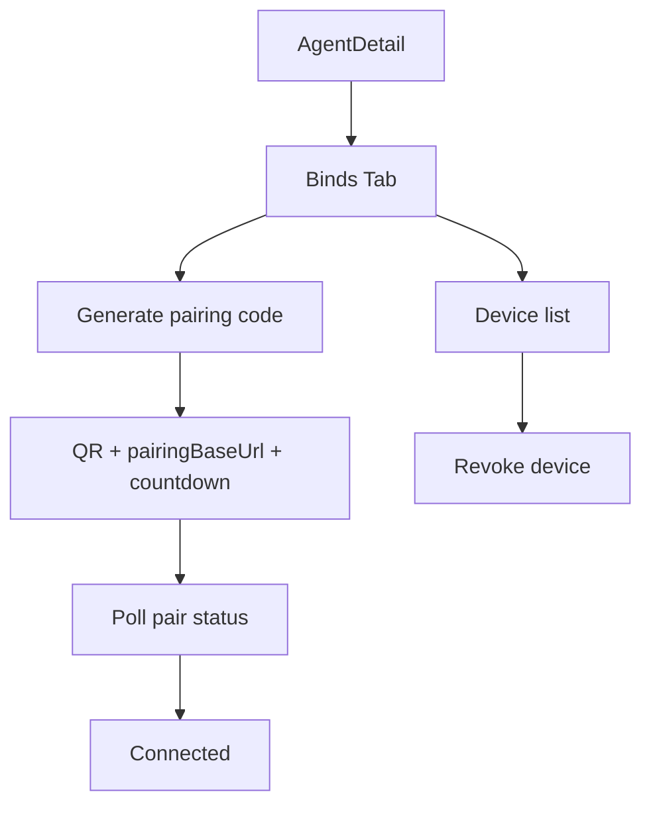

# Paperclip Android Agent Bind 协议（V1 已实现）

**日期**: 2026-06-13  
**状态**: Implemented  
**适用范围**: Paperclip Server（控制面）与 Android Client（接入端）

> 实现代码：`server/src/routes/agent-channels.ts`、`server/src/realtime/android-channel-ws.ts`、`ui/src/components/AgentBindsTab.tsx`

---

## 1. 功能概览

Agent 详情页新增 **Binds** Tab，支持：

1. 生成 Android 配对码（二维码 + `qrUrl`）
2. Web 轮询配对状态（`pending` → `connected`）
3. Android 扫码确认并获取长期 `deviceToken`
4. WebSocket 双向通信（`connected` / `message` / `reply` / `ping` / `pong` / `error`）
5. 设备列表与 Revoke（立即断链）

---

## 2. 前端 UI 流程



---

## 3. Base URL 与可达性（强约束）

### 配置优先级

1. `ANDROID_BIND_PAIRING_LAN_HOST`（开发推荐：`192.168.x.x`）
2. `ANDROID_BIND_PAIRING_BASE_URL`
3. `PUBLIC_APP_URL`
4. `requestBaseUrl(req)`（仅当非 loopback 时）

若解析结果为 `localhost` / `127.0.0.1` / `0.0.0.0`，`pair/start` 返回 **422** 并附带修复提示。

### 开发示例（手机与电脑同一 WiFi）

`pnpm dev` 默认 `local_trusted` 且只监听 `127.0.0.1`。要让手机访问，需同时：

```bash
export HOST=0.0.0.0
export PAPERCLIP_LOCAL_TRUSTED_ALLOW_NON_LOOPBACK_BIND=true
export ANDROID_BIND_PAIRING_LAN_HOST=192.168.1.42   # 本机 WiFi IP，勿用 VPN/tun0 的 10.x
pnpm dev
```

若 `ANDROID_BIND_PAIRING_LAN_HOST` 仍是 VPN 地址（如 `10.253.32.200`）而本机有 `192.168.x.x`，`pair/start` 会 **422**，Binds 页**不会显示二维码**（需改环境变量并重启后再点 Generate）。

### OpenVPN / tun0 联调

手机与服务器均通过 **同一 OpenVPN** 可达时，可继续使用 VPN 内网 IP，并显式跳过 WiFi 优先校验：

```bash
export HOST=0.0.0.0
export PAPERCLIP_LOCAL_TRUSTED_ALLOW_NON_LOOPBACK_BIND=true
export ANDROID_BIND_PAIRING_ALLOW_VPN_HOST=true
export ANDROID_BIND_PAIRING_LAN_HOST=10.253.32.200
pnpm dev
```

手机浏览器先验证：`http://10.253.32.200:3100/api/health`（须已连 OpenVPN）。

---

## 4. REST API

### 4.1 pair/start（Board）

`POST /api/agents/:agentId/channels/android/pair/start`

```json
{ "connectionName": "CEO Android Channel" }
```

响应：

```json
{
  "loginId": "uuid",
  "connectionId": "uuid",
  "expiresAt": "2026-06-13T03:10:00.000Z",
  "pairingBaseUrl": "https://paperclip.example.com",
  "qrUrl": "https://paperclip.example.com/channel/android/pair?login_id=...&connection_id=...&agent_id=...",
  "qrBase64": "data:image/png;base64,..."
}
```

### 4.2 pair/poll（Board）

`GET /api/agents/:agentId/channels/android/pair/poll?login_id=...`

```json
{ "status": "pending" }
```

或：

```json
{
  "status": "connected",
  "deviceId": "android_pixel8_xxx",
  "deviceName": "Alice Pixel 8",
  "confirmedAt": "2026-06-13T03:05:00.000Z"
}
```

### 4.3 pair/confirm（匿名，Android）

`POST /api/channel/android/pair/confirm`

```json
{
  "login_id": "uuid",
  "connection_id": "uuid",
  "device_id": "android_pixel8_ab12cd34",
  "device_name": "Alice Pixel 8",
  "app_version": "1.0.0"
}
```

响应：

```json
{
  "deviceToken": "pcd_xxx",
  "deviceId": "android_pixel8_ab12cd34",
  "connectionId": "uuid",
  "agentId": "uuid",
  "wsUrl": "wss://paperclip.example.com/api/channel/android/ws"
}
```

### 4.4 devices / revoke（Board）

- `GET /api/agents/:agentId/channels/android/devices`
- `POST /api/agents/:agentId/channels/android/devices/:deviceId/revoke`

---

## 5. WebSocket 协议

**URL**: confirm 返回的 `wsUrl`  
**Header**: `Authorization: Bearer {deviceToken}`

### 服务端首帧

```json
{
  "type": "connected",
  "connection_id": "uuid",
  "device_id": "android_pixel8_ab12cd34",
  "agent_id": "uuid"
}
```

### 客户端消息

```json
{
  "type": "message",
  "peer_id": "user_10086",
  "peer_label": "张三",
  "text": "帮我看看今天任务进展"
}
```

### 服务端回包

```json
{
  "type": "reply",
  "peer_id": "user_10086",
  "text": "Message received. Agent notified.",
  "issue_id": "uuid"
}
```

### 心跳

- 服务端每 30s 发送 `{"type":"ping"}`
- 客户端回复 `{"type":"pong"}`
- 90s 无 pong 则断开

---

## 6. 业务映射（V1）

- 入站 `message` → 创建/复用 peer 对应 Issue → 写入 comment → `heartbeat.wakeup`
- Revoke 后立即关闭该设备所有 WS 连接

---

## 7. 联调清单

```bash
# 1. 启动（设置 LAN host）
export ANDROID_BIND_PAIRING_LAN_HOST=192.168.1.42
pnpm dev

# 2. 生成配对码
curl -X POST http://localhost:3100/api/agents/{agentId}/channels/android/pair/start \
  -H 'Content-Type: application/json' \
  -d '{"connectionName":"Test Android"}'

# 3. Android confirm
curl -X POST http://192.168.1.42:3100/api/channel/android/pair/confirm \
  -H 'Content-Type: application/json' \
  -d '{"login_id":"...","connection_id":"...","device_id":"dev1","device_name":"Pixel"}'

# 4. Web poll
curl "http://localhost:3100/api/agents/{agentId}/channels/android/pair/poll?login_id=..."

# 5. WS（需 websocat 或 Android 客户端）
# websocat -H="Authorization: Bearer pcd_..." wss://192.168.1.42:3100/api/channel/android/ws
```

- [ ] `qrUrl` host 非 loopback
- [ ] `pair/confirm` 成功
- [ ] `pair/poll` 显示 connected
- [ ] WS 收到 `connected`
- [ ] 发 `message` 后 Issue comment 产生且 agent wakeup
- [ ] revoke 后无法重连

---

## 8. 与 OpenClaw Invite 的区别

| 能力 | OpenClaw Invite | Android Bind |
|------|-----------------|--------------|
| 目标 | 新 Agent 入驻公司 | 已有 Agent 绑定 Android 客户端 |
| 数据表 | invites / join_requests | agent_channel_* |
| 长期凭证 | Agent API Key | Device Token (`pcd_`) |

两者业务语义独立，仅复用短期令牌与审计模式思路。
