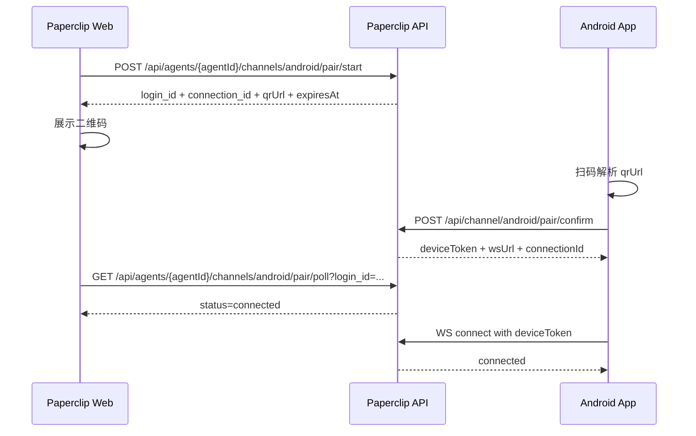

# Paperclip Android Agent Bind 协议草案（V1）

**日期**: 2026-06-13  
**状态**: Superseded by [`doc/ANDROID_CHANNEL_PAIRING.md`](../ANDROID_CHANNEL_PAIRING.md) (Implemented)
**适用范围**: Paperclip Server（控制面）与 Android Client（接入端）

---

## 1. 协议目标

定义一套稳定的 Android 绑定协议，使客户端可以：

1. 扫码完成与指定 Agent 的绑定；
2. 获取长期设备凭证；
3. 通过 WebSocket 与服务端进行双向通信；
4. 在断线后可重连并保持设备身份。

---

## 2. 术语

- **Connection**: 某个 Agent 的一个 Android 绑定通道配置。
- **Pair Session**: 一次二维码配对会话（短期有效）。
- **Device**: 一个完成配对的 Android 设备。
- **Device Token**: 设备长期凭证（服务端仅存 hash）。
- **Peer**: 设备内终端用户 ID（用于会话隔离）。

---

## 3. Base URL 与可达性（强约束）

### 3.1 原则

- 二维码中的 URL 和 `pair/confirm` 返回的 `wsUrl` 必须是手机可访问地址。
- 禁止写入 `localhost`、`127.0.0.1`、`0.0.0.0`。

### 3.2 建议配置优先级（Paperclip）

1. `ANDROID_BIND_PAIRING_LAN_HOST`
2. `ANDROID_BIND_PAIRING_BASE_URL`
3. `PUBLIC_APP_URL`
4. `requestBaseUrl(req)`（最后兜底，仅在可达时使用）

若最终解析为 loopback，`pair/start` 应直接返回 `422` 并附带修复提示。

---

## 4. 配对流程



---

## 5. 二维码格式

二维码内容为 URL 文本，示例：

```text
https://paperclip.example.com/channel/android/pair?login_id=550e8400-e29b-41d4-a716-446655440000&connection_id=12&agent_id=xxxx
```

Android 只做两件事：

1. 解析 `login_id`、`connection_id`；
2. 调用 `pair/confirm`，不擅自改写 host。

---

## 6. REST API（建议）

## 6.1 pair/start（Web 调用）

`POST /api/agents/:agentId/channels/android/pair/start`

Auth: board session  
Request:

```json
{
  "connectionName": "CEO Android Channel"
}
```

Response:

```json
{
  "loginId": "uuid",
  "connectionId": 12,
  "expiresAt": "2026-06-13T03:10:00.000Z",
  "pairingBaseUrl": "https://paperclip.example.com",
  "qrUrl": "https://paperclip.example.com/channel/android/pair?login_id=...&connection_id=12"
}
```

## 6.2 pair/poll（Web 轮询）

`GET /api/agents/:agentId/channels/android/pair/poll?login_id=...`

Response:

```json
{
  "status": "pending"
}
```

或：

```json
{
  "status": "connected",
  "deviceId": "android_pixel8_xxx",
  "deviceName": "Alice Pixel 8",
  "confirmedAt": "2026-06-13T03:05:00.000Z"
}
```

## 6.3 pair/confirm（Android 调用）

`POST /api/channel/android/pair/confirm`

Auth: 无（依赖一次性令牌）  
Request:

```json
{
  "login_id": "uuid",
  "connection_id": 12,
  "device_id": "android_pixel8_ab12cd34",
  "device_name": "Alice Pixel 8",
  "app_version": "1.0.0"
}
```

Response:

```json
{
  "deviceToken": "pcd_xxx",
  "deviceId": "android_pixel8_ab12cd34",
  "connectionId": 12,
  "agentId": "uuid",
  "wsUrl": "wss://paperclip.example.com/api/channel/android/ws"
}
```

错误码建议：

- `400`：`login_id` 过期/不匹配/参数非法
- `404`：`connection_id` 不存在
- `409`：pair session 已消费

## 6.4 device list / revoke（Web）

- `GET /api/agents/:agentId/channels/android/devices`
- `POST /api/agents/:agentId/channels/android/devices/:deviceId/revoke`

---

## 7. WebSocket 协议（Android）

## 7.1 连接

URL: `wsUrl`（由 confirm 返回）  
Header:

```http
Authorization: Bearer {deviceToken}
```

## 7.2 服务端首帧

```json
{
  "type": "connected",
  "connection_id": 12,
  "device_id": "android_pixel8_ab12cd34",
  "agent_id": "uuid"
}
```

## 7.3 客户端发消息

```json
{
  "type": "message",
  "peer_id": "user_10086",
  "peer_label": "张三",
  "text": "帮我看看今天任务进展"
}
```

## 7.4 服务端回包

```json
{
  "type": "reply",
  "peer_id": "user_10086",
  "text": "当前 CEO 正在推进 3 个任务...",
  "issue_id": "uuid",
  "session_id": "uuid"
}
```

## 7.5 心跳

服务端每 30s：

```json
{"type":"ping"}
```

客户端回复：

```json
{"type":"pong"}
```

90s 无 pong 则断开。

## 7.6 错误帧

```json
{
  "type": "error",
  "code": "invalid_payload",
  "message": "peer_id and text are required"
}
```

---

## 8. 与 Paperclip 任务模型对齐（V1建议）

### 入站映射

- `message` 入站后，映射为目标 issue comment（或按规则创建 issue）。
- 写 comment 后触发 `heartbeat.wakeup`。

### 出站映射

- agent 的 issue comment / run summary 映射为 `reply`。

这样可以避免另起一套聊天数据模型，保持审计与治理一致。

---

## 9. 安全要求

1. `deviceToken` 必须安全存储（Android Keystore）。
2. 服务端只存 `device_token_hash`，禁止明文落库。
3. `pair/start` 必须对 base URL 做 loopback 拦截。
4. `pair/confirm` 和 WS 握手做速率限制。
5. 设备 revoke 后立即断链并拒绝重连。

---

## 10. 与 Settings 里 OpenClaw Invite 的关系

你在 `Company Settings` 看到的 `Generate OpenClaw Invite Prompt`，本质是：

- 给“外部 OpenClaw Gateway Agent”生成入驻邀请码与 onboarding 提示；
- 走的是 `invites/join_requests` 体系；
- 目标是把一个“新的执行代理”接入公司，不是绑定 Android 客户端。

### 关系判断

- **不是同一功能**：OpenClaw Invite != Android Bind
- **有机制复用价值**：
  - 一次性短期 token
  - onboarding 文本生成
  - reachability 检查思路（避免不可达 host）
  - 审计与状态机范式（pending/approved/expired）

建议：Android Bind 不直接复用 `invites` 业务语义，但可复用其技术模式与部分工具函数思想。

---

## 11. Kotlin 客户端示例（精简）

```kotlin
val confirmBody = JSONObject()
  .put("login_id", loginId)
  .put("connection_id", connectionId)
  .put("device_id", deviceId)
  .put("device_name", Build.MODEL)

val confirmResp = api.post("/api/channel/android/pair/confirm", confirmBody)
val deviceToken = confirmResp.getString("deviceToken")
val wsUrl = confirmResp.getString("wsUrl")

val req = Request.Builder()
  .url(wsUrl)
  .header("Authorization", "Bearer $deviceToken")
  .build()

client.newWebSocket(req, object : WebSocketListener() {
  override fun onMessage(webSocket: WebSocket, text: String) {
    val msg = JSONObject(text)
    when (msg.getString("type")) {
      "ping" -> webSocket.send("""{"type":"pong"}""")
      "reply" -> {/* render */}
    }
  }
})
```

---

## 12. 联调最小清单

- [ ] Web 点击生成配对码，`qrUrl` host 非 loopback
- [ ] Android 扫码 `pair/confirm` 成功
- [ ] Web `pair/poll` 显示 connected
- [ ] Android WS 收到 `connected`
- [ ] 发 `message`，服务端收到并产生业务处理结果
- [ ] revoke 后设备无法再连

